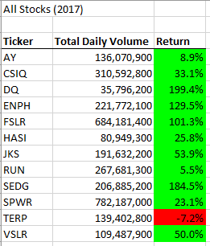
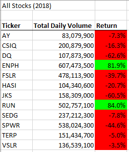
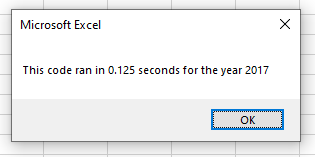
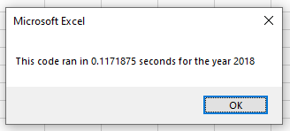

# Stocks with VBA

## Overview of Project

### Purpose

Steve has asked for help analyzing green energy stocks for his parents in order to diversify their funds. I will be using VBA to automate the analysis process and refactoring the code so it can be used in the future with a larger dataset that includes the entire stock market.  

## Results

### Stock Performance

The stock dataset analyzed included 12 green energy stocks for 2017 and 2018. The stock performance was extremely volatile between the two years, with all but one stock having a positive return in 2017 and all but two stocks having a negative return in 2018, as seen in the images below.

Since there are significant swings between the two years, it would be a good idea to analyze the entire stock market to see if this was an overall trend or something specific to green energy stocks. This will help determine a plan for diversifying their funds. 

### Script Execution Times

Because the original dataset was only for 12 stocks, the original script looped through each ticker and then looped through all the rows to collect the necessary information for that ticker. It took about 0.86 seconds to run, and while this may not seem like a long time, there is a more efficient way to structure the code. Instead of looping through the rows every time for each ticker, it would be faster to loop through the rows only once. In order to collect and store the information for all the tickers to output later, I created various arrays that could hold the data. This refactored script ran much faster as seen in the pictures below.

While this might not make much of a difference with the original dataset of only a handful of stocks, the time saved would be significant for a dataset that includes the entire stock market. 

## Summary

- There are advantages and disadvantages of refactoring code. Refactoring code can make it more efficient and therefore run faster. It can also make the flow more logical, so it is easier to read and understand. A downside of refactoring code is that it can be very time consuming for little benefit. There's also the risk that you break the code and are unable to get it working again, so must go back to the original.

- In terms of this VBA script, there were pros and cons to refactoring. An advantage was the refactored code ran faster since it did not have to keep looping over the same rows, which was a more efficient way to solve the problem. A disadvantage was that it took more time to refactor the code than the run time saved.
